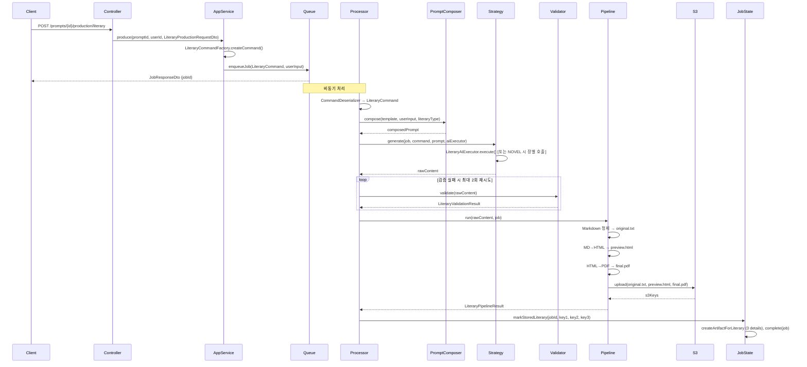

# 완성 작품 생성(Literary Generation) 아키텍처

## 1. 개요

- **목표**: POEM | SHORT_STORY | NOVEL | SCRIPT 형식에 맞는 완성 작품 생성
- **전제**: 프롬프트 템플릿(DB), 사용자 입력(user_input), LiteraryType
- **결과물**: S3에 파일 저장, HTML 미리보기 + PDF 다운로드 지원

## 2. 패키지 구조

```text
module/domain/production/
├── model/
│   ├── contract/command/
│   │   ├── ProductionCommandType.java  (+ LITERARY)
│   │   └── ProductionCommand.java
│   ├── executor/
│   │   └── literary/
│   │       └── LiteraryCommand.java
│   └── literary/
│       └── LiteraryType.java           (POEM, SHORT_STORY, NOVEL, SCRIPT)
├── service/
│   ├── prompt/
│   │   ├── PromptTemplateService.java (LITERARY 분기)
│   │   ├── PromptMerger.java          (LITERARY → LiteraryPromptComposer)
│   │   └── literary/
│   │       ├── LiteraryPromptComposer.java      (Prompt Composition Layer)
│   │       └── LiteraryFormatRules.java         (형식 강제 규칙)
│   ├── literary/
│   │   ├── LiteraryGenerationStrategy.java      (Strategy 인터페이스)
│   │   ├── impl/
│   │   │   ├── PoemGenerationStrategy.java
│   │   │   ├── ShortStoryGenerationStrategy.java
│   │   │   ├── NovelGenerationStrategy.java      (장 단위, 토큰 제한, 병합)
│   │   │   └── ScriptGenerationStrategy.java
│   │   ├── validation/
│   │   │   ├── LiteraryOutputValidator.java
│   │   │   └── impl/ (LiteraryType별 검증)
│   │   ├── pipeline/
│   │   │   └── LiteraryOutputPipeline.java      (MD 정제 → HTML → PDF → S3)
│   │   └── novel/
│   │       ├── ChapterPlan.java
│   │       ├── TokenEstimator.java
│   │       └── ChapterMergeHelper.java
│   └── ...
├── application/
│   ├── factory/impl/
│   │   └── LiteraryCommandFactory.java
│   └── ...
```

## 3. 처리 흐름

```text
[Request] LiteraryProductionRequestDto(literaryType, fileName, format, userInput)
    → ProductionApplicationService.produce()
    → LiteraryCommandFactory.createCommand() → LiteraryCommand
    → ValidatorRegistry.validate(LiteraryCommand)
    → JobQueueService.enqueueJob(promptId, userId, LiteraryCommand, userInput)

[Async Job] JobProcessorDelegate.processJob(jobId)
    → CommandDeserializer → LiteraryCommand
    → PromptTemplateService.mergePrompt() → LiteraryPromptComposer.compose()
    → LiteraryGenerationStrategyRegistry.getStrategy(literaryType).generate()
        [NOVEL만] ChapterPlan → per-chapter generate (token 제한) → merge
    → LiteraryOutputValidator.validate() → 실패 시 재요청(Retry, 최대 2회)
    → LiteraryOutputPipeline.run(markdown)
        → Markdown 정제 → original.txt
        → Markdown → HTML → preview.html
        → HTML → PDF (OpenHTMLToPDF) → final.pdf
        → S3 업로드 (production/{userId}/{jobId}/original.txt | preview.html | final.pdf)
    → JobStateService.markStoredLiterary(jobId, originalKey, previewKey, pdfKey)
    → PresignedUrlService (기존)로 다운로드/미리보기 URL 제공
```

### 처리 흐름 다이어그램 (Mermaid)



## 4. 핵심 인터페이스

### LiteraryGenerationStrategy

```java
public interface LiteraryGenerationStrategy {
    LiteraryType getLiteraryType();
    String generate(JobEntity job, LiteraryCommand command, String composedPrompt, LiteraryAIExecutor aiExecutor);
}
```

### LiteraryOutputValidator

```java
public interface LiteraryOutputValidator {
    LiteraryType getLiteraryType();
    LiteraryValidationResult validate(String rawContent);
}
```

### LiteraryPromptComposer

- `compose(promptContent, userInput, literaryType)`: 시스템/템플릿 + 사용자 입력 + LiteraryType별 형식 규칙 결합
- 형식 강제 규칙 포함, "결과물 외 설명 금지" 명시

## 5. 파일 구조 (S3)

- `production/{tenantId?}/{userId}/{jobId}/original.txt`  — 원본(정제된 Markdown 또는 텍스트)
- `production/{tenantId?}/{userId}/{jobId}/preview.html` — HTML 미리보기
- `production/{tenantId?}/{userId}/{jobId}/final.pdf`    — PDF 다운로드

## 6. 형식별 주의사항 (프롬프트/검증)

| 타입 | 규칙 |
|------|------|
| POEM | 행 단위 구성, 불필요한 산문 제거 |
| SHORT_STORY | 도입-전개-클라이맥스-결말, 완결된 단편 |
| NOVEL | 장(Chapter) 단위, 토큰 초과 시 분할 생성 후 병합 |
| SCRIPT | 소설 서술체 금지, 등장인물 이름 + 대사, Scene 구분 필수 |

## 7. 예외 처리

- **Validation Layer**: AI 응답이 형식을 따르지 않으면 `LiteraryOutputValidator`가 실패 반환
- **Retry**: 형식 검증 실패 시 재요청 (기존 AIRetryExecutor 확장 또는 Literary 전용 retry 루프)
- Retry Policy: 최대 N회, 백오프 적용

## 8. 확장성

- 새 LiteraryType 추가 시: enum 추가, Strategy 구현체, Validator 구현체, FormatRules 텍스트 추가
- 전략/검증은 Registry로 조회하여 O(1) 확장
